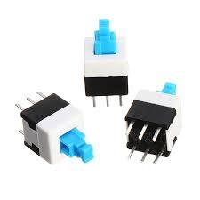

The original project was created by the user buba447. Manual is [here](https://withrow.io/simpsons-tv-build-guide) and source is [here](https://github.com/buba447/simpsonstv). Original 3D model is [here](https://www.thingiverse.com/thing:4943159)

Second user created new 3D model for 4" Waveshare HDMI displa. Original 3D model is [here](https://www.thingiverse.com/thing:5019648)

***MY MANUAL IS CURRENTLY INCOMPLETED. I WORKING ON IT***

Manual Content
1. [ My changes ](#my_changes)
1. [ 3D model ](#3d_model)
2. [ HW parts ](#hw_parts)
3. [ HW construction ](#hw_construction)
4. [ Instalation ](#instalation)

---
<a name="my_changes"></a>
# My changes

My changes, all otested on the RPI ZERO:
- added pause video, when is button not pulled.
- added mudde audio amplifier if is button not pulled
- minor improvements to 3D models
- added button to 3D model VCR
- used different speaker
- used 4" HDMI waveshare LCD [here](https://www.waveshare.com/wiki/4inch_HDMI_LCD)
- design improvement. is more solid
- added space for USB port in the 3D model, and script for autocopy movie from USB mass storage devices to RPI 

---
<a name="3d_model"></a>
# 3D model

My 3D model is stored on the thingiverse page [here](https://www.thingiverse.com/thing:5147344)

---
<a name="hw_parts"></a>
# HW parts

- 1k potentiometer [here](https://www.tme.eu/en/details/pc16bu-1k-lin/cond-plastic-single-turn-potentiometers/omeg/)


- 7x7mm switch [here](https://www.aliexpress.com/item/32704922363.html)


- 4" HDMI Waveshare LCD 800x400 [here](https://rlx.sk/sk/9-5-lcd-display/5454-4inch-hdmi-lcd-800480-ips-waveshare-4-touch-screen-lcd-hdmi-interface-ips-screen-designed-for-raspberry-pi-12030.html)


- HDMI connector DIY [here](https://rpishop.cz/redukce/2176-waveshare-mini-hdmi-adapter-pro-diy-hdmi-kabel.html)


- MINI HDMI connector DIY [here](https://rpishop.cz/redukce/1205-waveshare-hdmi-adapter-pro-diy-hdmi-kabel-pravouhy.html)


- HDMI cable DIY [here](https://rpishop.cz/hdmi/1209-waveshare-diy-hdmi-plochy-kabel-02m.html)


- speaker [here](https://rpishop.cz/reproduktory/1204-waveshare-8-5w-reproduktor.html)


- rpi zero [here](https://rpishop.cz/zero/632-raspberry-pi-zero.html)


- audio amplifier [here](https://rlx.sk/sk/audio-voice-boards-speech-recognition/3397-mono-25w-class-d-audio-amplifier-pam8302-adafruit-2130.html)


- capacitor 2.2uF/50V


- screw M3 4x


- switch 6x6mm 2x [here](https://www.tme.eu/en/details/tact-64k/microswitches-tact/ninigi/) **watch out for the length of the button**


- micro USB connector [here](https://www.aliexpress.com/item/32916571891.html?spm=a2g0o.productlist.0.0.284c68canDNCGE&algo_pvid=d8468b46-a429-405d-a448-26761076313c&algo_exp_id=d8468b46-a429-405d-a448-26761076313c-5&pdp_ext_f=%7B%22sku_id%22%3A%2266023288418%22%7D)


- PCB with micro USB connector [here](https://www.aliexpress.com/item/4000484202812.html?spm=a2g0o.productlist.0.0.52451297eW2VB6&algo_pvid=d8623308-0e8e-433a-b8c3-d0a98947ac72&aem_p4p_detail=202111260636579663439259216280013679493&algo_exp_id=d8623308-0e8e-433a-b8c3-d0a98947ac72-9&pdp_ext_f=%7B%22sku_id%22%3A%2210000002007513401%22%7D)


- magnet circle 6x2mm


- 3mm LED


- USB A connector [here](https://www.aliexpress.com/item/4000806581109.html?spm=a2g0o.productlist.0.0.2c402a18K0POfK&algo_pvid=fe076f0d-f35f-4749-a6fb-6e73d8c0a93d&algo_exp_id=fe076f0d-f35f-4749-a6fb-6e73d8c0a93d-11&pdp_ext_f=%7B%22sku_id%22%3A%2210000008096938788%22%7D)


- Wires

---
<a name="hw_construction"></a>
# HW construction

***TODO***

## Pinout


Power switch
```
POWER SWITCH PIN A -> GPIO26
POWER SWITCH PIN B -> GND
```
Audio amplifier
```
AUDIO AMPLIFIER SIGNAL -> GPIO19
AUDIO AMPLIFIER SHUT DOWN -> GPIO13
AUDIO AMPLIFIER POWER -> +5V
AUDIO AMPLIFIER GROUND -> GND
```
Buttons
```
BUTTON NEXT VIDEO PIN A -> GPIO6
BUTTON NEXT VIDEO PIN B -> GND

BUTTON XXX PIN A -> GPIO5
BUTTON XXX PIN B -> GND
```
LED
```
LED FOR INDICATE USB COMMUNICATION ANODA -> GPIO27
LED FOR INDICATE USB COMMUNICATION KATODA -> GND
```

---
<a name="instalation"></a>
# Instalation

1. Install OS to micro SD card. For install OS please use Raspberry PI installer [here](https://www.raspberrypi.com/software/)
2. Create a file before inserting the micro SD card **wpa_supplicant.conf** in **boot** partition and add to file
```
country=US
ctrl_interface=DIR=/var/run/wpa_supplicant GROUP=netdev
update_config=1

network={
    ssid="NETWORK NAME"
    psk="NETWORK PASSWORD"
}
```
3. Create a empty file **ssh** before inserting the micro SD card in **boot** partition. For enable SSH server after booting linux
4. Now you can insert microSD card to RPI and power on. After booting is raspberry-pi automatically connected to WI-FI, with SSH server. After booting you can see IP at the home screen


5. **Update OS**
```
sudo apt-get update
sudo apt-get upgrade
sudo rpi-update
sudo apt-get upgrade
sudo reboot
```

6. **LCD driver**. go to **/boot/config.txt** and add next lines for enable LCD drivers. Save, and reboot RPI. Manual for installation  manual is [here](https://www.waveshare.com/wiki/4inch_HDMI_LCD)

```
sudo nano /boot/config.txt
```

add to end file

```
hdmi_group=2
hdmi_mode=87
hdmi_timings=480 0 40 10 80 800 0 13 3 32 0 0 0 60 0 32000000 3
dtoverlay=ads7846,cs=1,penirq=25,penirq_pull=2,speed=50000,keep_vref_on=0,swapxy=0,pmax=255,xohms=150,xmin=200,xmax=3900,ymin=200,ymax=3900
display_rotate=3
hdmi_drive=1
hdmi_force_hotplug=1
```

7. **LCD driver.** Install drivers for LCD
```
git clone https://github.com/waveshare/LCD-show.git
cd LCD-show/
chmod +x LCD4-800x480-show
sudo ./LCD4-800x480-show
```
8. **Enable audio.** add to file **/boot/config.txt**
```
sudo nano /boot/config.txt
```
add to end file
```
dtparam=audio=on
dtoverlay=audremap,enable_jack,pins_18_19
```
9. **Enable audio.** Update file **/etc/rc.local**
```
sudo nano /etc/rc.local
```
add to end file, before **exit 0** line
```
raspi-gpio set 18 op dl
raspi-gpio set 19 op a5 
raspi-gpio set 8 a2
raspi-gpio set 7 a2
```
10. Update **/boot/cmdline.txt**
```
sudo nano /boot/cmdline.txt
```
my file contain
```
console=serial0,115200 console=tty1 root=/dev/mmcblk0p2 rootfstype=ext4 elevator=deadline fsck.repair=yes rootwait quiet splash fbcon=map:10 fbcon=font:ProFont6x11
```
11. **Install package to OS**
```
sudo apt-get install omxplayer git mc screen rsync
```
12. **Clone repository**
```
cd ~
git clone https://github.com/johnyHV/simpsonstv
cd simpsonstv
```
13. **Service**. Service for management buttons
```
sudo nano /etc/systemd/system/tvbutton.service
```
and insert to file
```
[Unit]
Description=tvbutton
After=network.target

[Service]
WorkingDirectory=/home/pi/simpsonstv/
ExecStart=/usr/bin/python /home/pi/simpsonstv/buttons.py
Restart=always

[Install]
WantedBy=multi-user.target
```
14. **Service**. Service for management video player
```
sudo nano /etc/systemd/system/tvplayer.service
```
and insert to file
```
[Unit]
Description=tvplayer
After=network.target

[Service]
WorkingDirectory=/home/pi/simpsonstv/
ExecStart=/usr/bin/python /home/pi/simpsonstv/player.py
Restart=always

[Install]
WantedBy=multi-user.target
```
15. **Update permission for script**
```
sudo chmod +x /home/pi/simpsonstv/dbuscontrol.sh
```
16. **Version with USB**. Service for auto copy files from USB mass storage devices to RPI flash drive. 
```
sudo nano /etc/systemd/system/tvautocopy.service
```
and insert to file
```
[Unit]
Description=tvbutton
After=network.target

[Service]
WorkingDirectory=/home/pi/simpsonstv/
ExecStart=/usr/bin/python /home/pi/simpsonstv/autocopy.sh
Restart=always

[Install]
WantedBy=multi-user.target
```
17. **Version with USB**. Enable autocopy service
```
sudo chmod +x /home/pi/simpsonstv/autocopy.sh
```
18. **Service**. Enable services
```
sudo systemctl enable tvbutton.service
sudo systemctl enable tvplayer.service
sudo systemctl enable tvautocopy.service
```
19. **Reboot system**
```
sudo reboot
```
20. Now we need convert video file to **mp4** format. For this exist python script encode.py stored in **~/simpsonstv/video/**. Video file you can convert on RPI (but it's very tedious and slow) or on the your computer. You can use different SW for converting video file. 
```
~/simpsonstv/video/
sudo python encode.py
```
21. **Copy video to RPI**. 
**Copy via network** For example, you can use **scp** or **winscp**, for copy files via network sfp to RPI. Directory for video
```
~/simpsonstv/videos
```
**Copy movie from USB**. We need create a folder **simpsonstv** on the USB key in root, and store movies to this folder. After booting linux, and insert USB key is automaticly started script for copy movies from FLASH drive to micro SD card. the LED near the USB port lights up during the copying process. When copying is complete, the LED will turn off and you can disconnect the USB key

**IMAGE**
